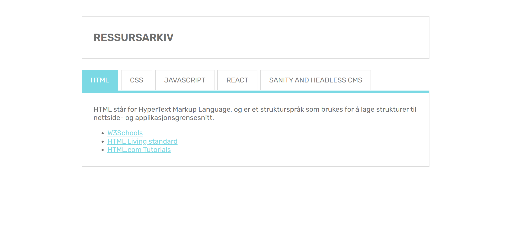

# uin23ak2_resource_layout_begby

## Oppgavetekst fra Canvas

Arbeidskrav 2: HTML, CSS og JavaScript-oppfriskning

OBS: Denne oppgaven skal leveres individuelt!

Opprett et public GitHub-repository kalt "uin23ak2_resource_layout_LASTNAME". Bytt ut LASTNAME med ditt etternavn.

I dette GitHub-repositoriet skal du opprette og kode nødvendige HTML, CSS, og JavaScript-filer for et ressursarkiv. Ressursarkivet skal se ut og linkes opp som vist i skisser i kursets Github-repository. I mappen arbeidskrav_2 (Klon dette repositoriet, og kopier filer du skal benytte derfra til ditt eget repository).

I arbeidskrav to skal du:

1. Utvikle HTML-strukturen og CSS-stilene nødvendig for å få en nettside med samme utseende som skissene fra arbeidskrav_2-mappen
2. Inkludere ressurser.js i HTML-filen
3. Bruke moderne JavaScript for å liste opp ressursene. Disse skal være kategorisert, og kunne navigeres mellom i en fanemeny som vist på skissene i arbeidskrav_2-mappen. Alle ressursene skal kunne klikkes på og lede brukeren videre til URL-en ressursen peker til.
Innlevering
Oppgaven leveres som en URL til ditt GitHub-repository.

OBS:

Vi ser datoer på endringer i filer på GitHub. Filer med endringsdato senere enn leveringsfrist vil kvalifisere som fusk og ikke bli godkjent.
Husk å gjøre GitHub-repositoriet ditt public, slik at vi får tilgang til det.

## Screenshot

## Notat

Siden skissen lenket [her](https://github.com/toremake/UIN_coursefiles_2023/tree/main/arbeidskrav_2) ikke har bilder som illustrerer hover-effekter eller lignende har jeg tatt egne valg her.
